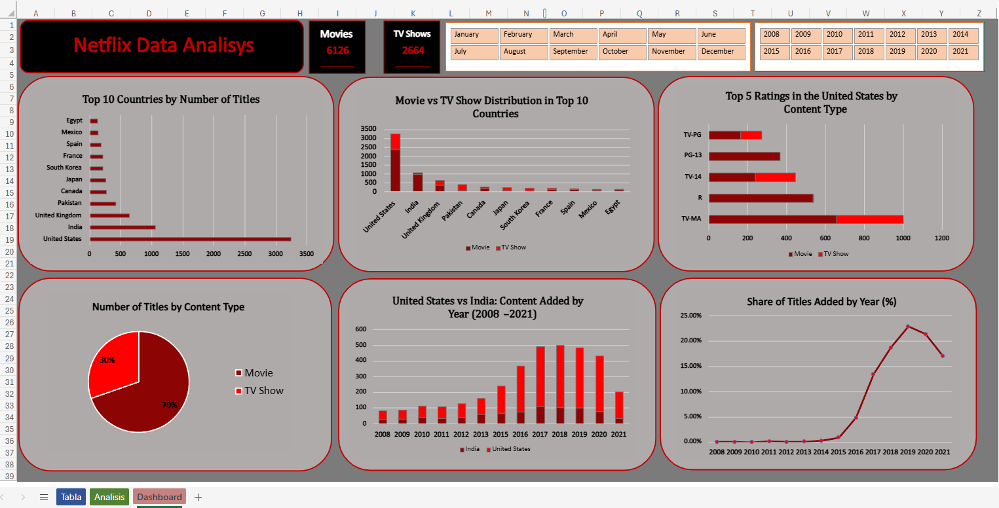
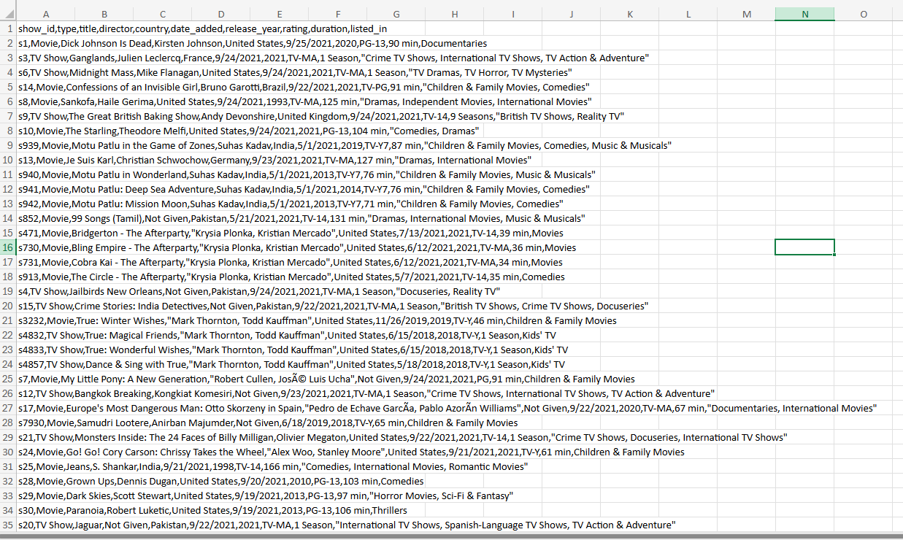
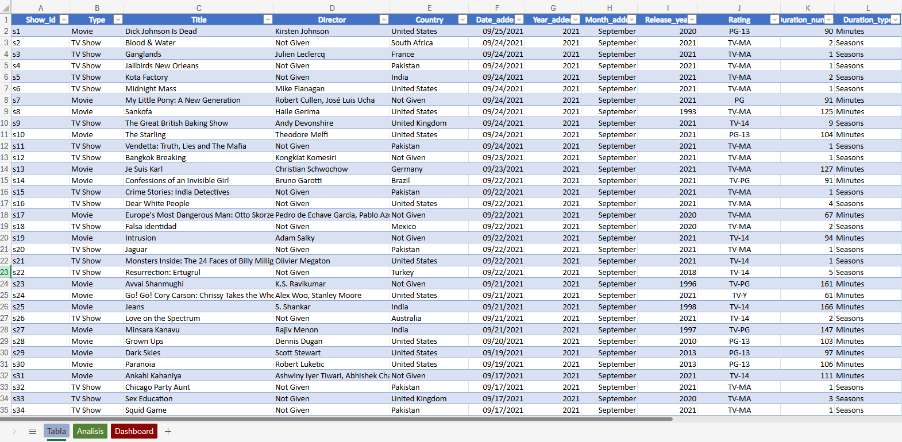

# Netflix Content Analysis (Excel)

Análisis de contenido del dataset de Netflix utilizando Microsoft Excel, incluyendo procesos de limpieza, transformación y visualización de datos mediante tablas dinámicas y dashboards interactivos.

---

## Objetivo

Organizar y transformar el dataset original con el fin de realizar un análisis estructurado de los datos y desarrollar un dashboard que facilite su visualización e interpretación.

---

## Herramientas utilizadas

- Tablas dinámicas
- Gráficos dinámicos
- Segmentaciones (slicers)
- Funciones de Excel (para limpieza y análisis de datos)

---

## Proceso

1. Limpieza y organización del dataset original  
2. Transformación de variables (fechas, duración, clasificaciones)  
3. Creación de columnas auxiliares para análisis  
4. Construcción de tablas dinámicas  
5. Desarrollo de dashboard interactivo  

---

## Análisis realizados

- Top 10 países por cantidad de títulos  
- Distribución de contenido por tipo (Movies vs TV Shows)  
- Clasificación de contenido por rating  
- Evolución del contenido a lo largo del tiempo  
- Comparación entre países
- Otros análisis exploratorios (no incluidos)

---

## Dataset

El dataset contiene información sobre títulos disponibles en Netflix, incluyendo:

- Tipo de contenido  
- País  
- Año de lanzamiento  
- Fecha de incorporación  
- Clasificación (rating)  
- Duración

---

## Dashboard

---

## Visualización de datos

### Dataset original

### Dataset procesado

---

## Archivos del proyecto

- `netflix_content_analysis.xlsx` → tabla, analisis y dashboard 
- `data/netflix_dataset.xlsx` → dataset original  
- `images/` → capturas del proyecto  

---

